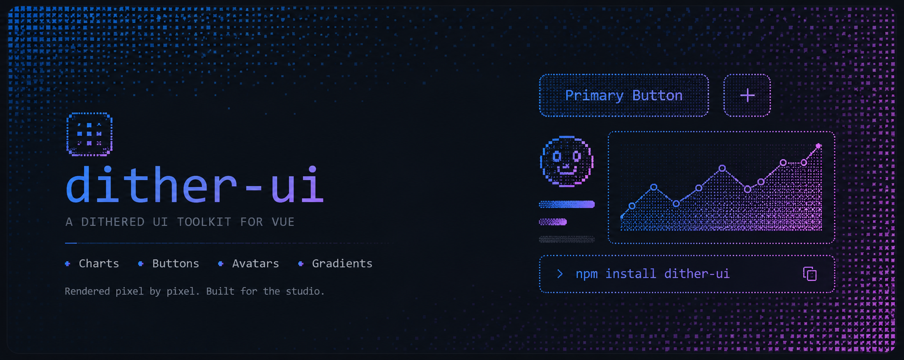

# dither-ui



A faithful **Vue 3** port of [Dither Kit](https://tripwire.sh/dither-kit) — composable
ordered-dither **area, line, bar, pie and radar** charts on one tiny canvas engine,
plus generative **avatars**, **buttons**, and **gradient washes**. Charts inspired by
[Evil Charts](https://evilcharts.com).

Copy-in components (shadcn-style): the library lives in `dither-kit/` with no
imports from the app. Its runtime dependencies are Vue, `d3-scale`, `d3-shape`,
`clsx` and `tailwind-merge`.

The repo ships three surfaces on one hash router:

- **Landing** (`/#/`) — marketing page
- **Docs** (`/#/docs`) — component docs, interactive playgrounds, example blocks
- **Studio** (`/#/studio`) — a Figma-style multi-artboard editor

```bash
npm install
npm run dev      # http://localhost:5173 — the site; /studio is the editor
npm run test     # engine + model unit tests (vitest)
npm run build    # type-check + production build
# GitHub Pages uses .github/workflows/pages.yml and builds for dither-ui.com by default.
# public/CNAME sets the custom domain; set VITE_BASE_PATH=/dither-ui/ only for project-URL deploys.
```

## Studio

A full design-tool editor for every component in the kit:

- **Canvas** — infinite pan/zoom (wheel pan, ⌘-wheel zoom, ⇧1 fit), multiple
  artboards: drag, resize, duplicate (⌘D), group (⌘G), lock (⌘L), hide, delete.
- **Layer tree** — frames expand to their chart layers; visibility/lock
  toggles, right-click context menus, inline rename, keyboard operable.
- **Inspector — full granularity.** Charts: type, per-series colour (presets +
  HSV/hex picker), texture (preset variants or custom ramp/density/gaps/hatch/
  off-tier/edge), bloom (presets or custom blur/brightness/opacity/saturate),
  easing (presets or a draggable cubic-bézier curve editor with overshoot),
  animation time/delay/stagger/sparkles/hover-lift, dither pixel size, margins,
  axes/grid/legend/tooltip settings, per-series opacity + dot markers, and
  per-type geometry (bar gap/edge, pie start angle/pop/rim, radar rings/falloff).
- **Widget builders** — avatar (seed, mirror, grid, cell resolution, density,
  colour, bloom, entrance), button (label, variant, pixel, colour, bloom),
  gradient (direction, pixel, opacity, from/two-tone-to, bloom).
- **Data editor** — a spreadsheet drawer per chart: edit any cell, add/remove
  rows and series; pie rows are slices (name/series stay synced).
- **Code export** — a runnable Vue SFC per artboard reflecting every setting.
- **Projects** — autosave to localStorage, save/open `.json` project files,
  undo/redo (⌘Z/⌘⇧Z), shortcuts overlay (?).

## Architecture (Feature-Sliced Design)

```
dither-kit/   the component library (@dither-kit)
src/
  app/        root + styles + hash routing
  pages/      landing, docs, studio
  widgets/    canvas, layer-tree, inspector, toolbar, data-editor,
              chart-renderer, widget-renderer
  features/   pan-zoom, artboard-transform, keyboard, history,
              persistence, export-code
  entities/   chart (model/rows/codegen), widget, artboard, editor
  shared/     ui (fields, editors), lib, config
tests/        vitest unit tests over the engine + models
```

Imports inside `src/` only ever point downward (app → … → shared); each slice
exposes a public `index.ts` barrel. The app imports the portable kit through
`@dither-kit`.

## Usage

Charts use a **children-as-config** API — compose parts inside a root:

```vue
<script setup lang="ts">
import {
  AreaChart, Area, Grid, XAxis, YAxis, Legend, Tooltip,
  type ChartConfig,
} from "@dither-kit"

const data = [
  { month: "Jan", desktop: 186, mobile: 80 },
  { month: "Feb", desktop: 305, mobile: 200 },
]
const config: ChartConfig = {
  desktop: { label: "Desktop", color: "blue" },
  mobile: { label: "Mobile", color: "purple" },
}
</script>

<template>
  <div class="h-80">
    <AreaChart :data="data" :config="config" bloom="low">
      <Grid />
      <XAxis dataKey="month" />
      <YAxis />
      <Area dataKey="desktop" is-clickable />
      <Area dataKey="mobile" variant="hatched" is-clickable />
      <Legend is-clickable />
      <Tooltip labelKey="month" />
    </AreaChart>
  </div>
</template>
```

Roots must be given a sized container (the canvas measures its parent).

### Fast And Precompiled Rendering

For deterministic server-rendered surfaces, compile the dither backing store on
the server and send its encoded image URL to the kit. The compiler has no DOM,
canvas, or Vue dependency and returns RGBA pixels, so use the image encoder your
server already uses:

```ts
import sharp from "sharp"
import { renderDitherGradient } from "@dither-kit"

const raster = renderDitherGradient({
  width: 960, height: 600, cell: 2, from: "blue", to: "transparent", seed: 42,
})
const png = await sharp(Buffer.from(raster.data), {
  raw: { width: raster.width, height: raster.height, channels: 4 },
}).png().toBuffer()
// Store png and pass its URL to the client.
```

Pass the packaged URL through `precompiled`. On charts it replaces only the
plot canvas, so axes, legends, tooltips, and interactions can remain composed
around it. The asset must match the chart's plot dimensions and should be
invalidated when data, colors, dimensions, or dither props change:

```vue
<AreaChart :data="data" :config="config" :precompiled="{ src: chartPngUrl }" :animate="false">
  <Grid /><XAxis dataKey="month" /><YAxis />
  <Area dataKey="desktop" />
</AreaChart>
```

`DitherGradient`, `DitherImage`, `DitherButton`, and `DitherSpinner` accept the
same `precompiled` URL. Use `renderMode="static"` when the visual should still
be painted in the browser but never animate or observe resizes. Without a
packaged asset, the kit also batches gradient/button/spinner pixels through
`ImageData`, caps chart backing resolution with `cell`, pauses off-screen chart
loops, and avoids rebuilding bloom layers when the frame is unchanged.

### Benchmark

Open `http://localhost:5173/benchmarks/` after `npm run dev`. The browser
benchmark performs 3 warmups, then 6 measured batches × 2 repetitions.
Gradient samples run at 960×600 CSS px with 2 px cells and compare the legacy
per-cell `fillRect` painter with RGBA generation plus one `putImageData` upload.
Button samples run at 240×56 CSS px and compare fresh RGBA allocation against a
reused target buffer. The table reports mean, median, p95, canvas calls, and
RGBA allocation count.

A local Chrome run of the expanded benchmark produced:

| Painter | Mean | Median | p95 | Canvas calls | RGBA allocations |
| --- | ---: | ---: | ---: | ---: | ---: |
| Gradient legacy fillRect | 109.11 ms | 107.70 ms | 174.40 ms | 144,000 | 0 |
| Gradient RGBA + putImageData | 4.70 ms | 4.10 ms | 10.00 ms | 1 | 13 |
| Button fresh RGBA buffer | 0.28 ms | 0.30 ms | 0.40 ms | 1 | 24 |
| Button reused RGBA buffer | 0.45 ms | 0.20 ms | 2.90 ms | 1 | 2 |

The gradient rows in that run show a **23.2× speedup** and **95.7% lower
measured paint latency**. The button rows are intentionally small in wall-clock
terms; their useful signal is allocation behavior, where reuse keeps the repeated
RGBA buffer allocation count bounded at two reusable objects.

Earlier five independent local Chrome runs without CPU throttling produced:

| Run | Legacy mean | Legacy median | Legacy p95 | Raster mean | Raster median | Raster p95 |
| --- | ---: | ---: | ---: | ---: | ---: | ---: |
| 1 | 110.80 ms | 109.70 ms | 173.20 ms | 6.44 ms | 4.00 ms | 36.10 ms |
| 2 | 111.76 ms | 114.40 ms | 180.00 ms | 4.01 ms | 4.30 ms | 5.10 ms |
| 3 | 108.18 ms | 110.00 ms | 151.00 ms | 4.07 ms | 4.50 ms | 4.80 ms |
| 4 | 122.25 ms | 121.80 ms | 179.60 ms | 5.62 ms | 4.60 ms | 20.10 ms |
| 5 | 118.31 ms | 129.30 ms | 156.60 ms | 3.94 ms | 3.90 ms | 4.60 ms |
| Average mean | 114.26 ms | — | — | 4.82 ms | — | — |

The earlier average means show a **23.7× speedup** and **95.8% lower measured
paint latency**. Each legacy gradient sample made 144,000 `fillRect` calls; each
raster gradient sample made one `putImageData` upload. These are directional
measurements on one desktop, not a device-independent latency promise. Re-run
the page on target low-power devices before choosing `cell`, animation, bloom,
or precompilation policy.

### Components

Selected public exports:

| Charts | Parts | Standalone |
| --- | --- | --- |
| `AreaChart` `LineChart` | `Area` `Line` `Bar` `Pie` `Radar` | `DitherButton` |
| `BarChart` | `Grid` `XAxis` `YAxis` | `DitherAvatar` `DitherImage` |
| `PieChart` `RadarChart` | `Dot` `ActiveDot` `Legend` `Tooltip` | `DitherGradient` `DitherSpinner` |
| | `Sparkline` `RadarFrame` | |

The barrel also exports the rest of the control, feedback, navigation, overlay,
and surface set. Shared props: `bloom` (`off`/`low`/`high`/`aura`),
`bloomOnHover`, `animate`, `stackType` (`default`/`stacked`/`percent`),
`hovered`, `markerIndex`, `defaultSelectedDataKey`, `onSelectionChange`,
`onHoverChange`. Fill `variant`: `gradient`/`dotted`/`hatched`/`solid`.
Palette colors: `green` `blue` `purple` `pink` `orange` `red` `grey`.

## Port notes

- React context → Vue `provide`/`inject` with a reactive getter-facade controller.
- React `useMemo`/`useCallback` ceremony → Vue `computed`/`ref` (reactivity handles it).
- The `chartLayer` children-routing → render-function vnode inspection.
- The framework-agnostic `requestAnimationFrame` canvas painters port ~verbatim.
- The tooltip's `motion` spring → Vue `<Transition>` + a CSS glide (no extra dep).
- Tailwind v4 with shadcn-style tokens (`--foreground`, `--card`, …) in `src/styles.css`.

## Creator

- [Vova](https://github.com/drvova)

## Contributors

- [Vibhek Soni](https://github.com/vibheksoni)

## Credits

Dithering approach and the original **Dither Kit** charts by
[tripwire.sh/dither-kit](https://www.tripwire.sh/dither-kit).
